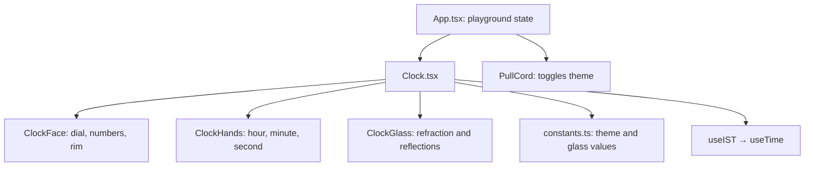

# Timelapse architecture

## Two clear layers

### The reusable clock

`components/Clock.tsx` is the product component. It reads the current time, calculates the hand angles, and assembles the dial, hands, rim, and glass layers. It accepts `theme="light"` or `theme="dark"`.

### The demo playground

`App.tsx` is the Timelapse site: plaster wall, physical pull cord, dark-room effect, and terminal monitor. It uses the clock but is not required when someone embeds the clock in their own React app.

## Visual system

- `ClockFace.tsx` renders static dial details and the rim image.
- `ClockHands.tsx` renders the moving hands. The yellow tail and centre cap are intentionally layered as one mechanism.
- `ClockGlass.tsx` sits last, creating the convex lens effect above all clock parts.
- `constants.ts` holds the two palettes and `CLOCK_GLASS` tuning values so visual changes remain centralized.

## Time flow

`useTime` updates from `requestAnimationFrame`. `useIST` applies the Indian Standard Time offset. `Clock.tsx` converts the current time into continuous hour, minute, and seconds rotations, so the seconds hand sweeps instead of jumping.
