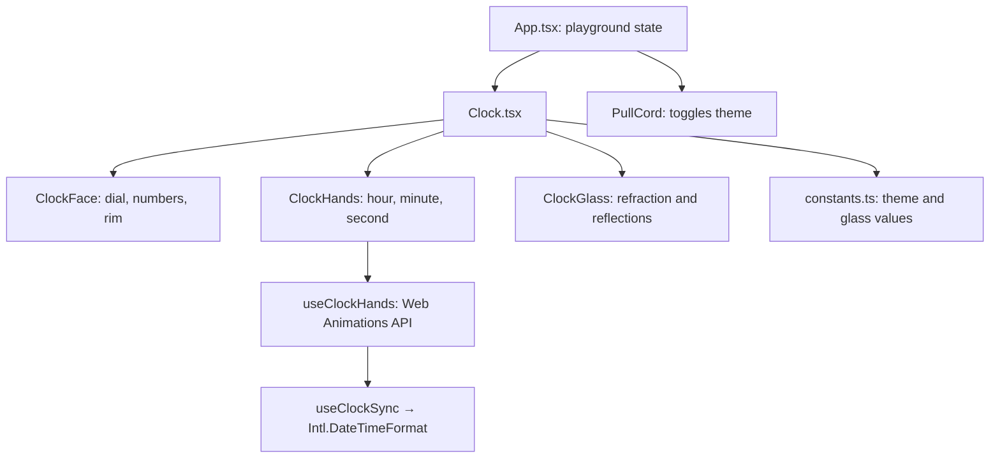

# Timelapse architecture

## Two clear layers

### The reusable clock

`components/Clock.tsx` is the product component. It reads the current time, calculates the hand angles, and assembles the dial, hands, rim, and glass layers. It accepts `theme="light"` or `theme="dark"`, imports its own `components/Clock/clock.css`, and has no outer/background shadow.

### The demo playground

`App.tsx` is the Timelapse site: plaster wall, physical pull cord, dark-room effect, and terminal monitor. These are presentation-only interactions. It uses the clock but is not required when someone embeds the clock in their own React app.

## Visual system

- `ClockFace.tsx` renders static dial details and the rim image.
- `ClockHands.tsx` renders the moving hands. The yellow tail and centre cap are intentionally layered as one mechanism.
- `ClockGlass.tsx` sits last, creating the convex lens effect above all clock parts.
- `constants.ts` holds the two palettes and `CLOCK_GLASS` tuning values so visual changes remain centralized.

## Time flow

A clock is a linear function of time, so Timelapse does no per-frame work at all. `useClockHands` gives each hand one infinite rotation (60s, 60min, 12h) through the Web Animations API and seeks its playhead to the current wall-clock position. The browser's animation engine owns the sweep from there: no React renders, no allocations, and no main-thread JavaScript per frame, so the hands stay smooth even while the main thread is busy.

`useClockSync` re-seeks every hand on a shared checkpoint that lands on :00 and :30 of each minute, and whenever the tab is restored. An animation timeline is monotonic while wall-clock time is not, so this is what absorbs daylight-saving jumps, NTP corrections, and sleep/resume. All clocks on a page share one timer.

`readClockTime` reads the requested zone through `Intl.DateTimeFormat`, so daylight-saving rules are handled by the browser. `Clock` defaults to Timelapse's `Asia/Chennai` alias, normalized to the official `Asia/Kolkata` zone (IST, UTC+05:30). An unrecognized zone falls back to the device's own zone with one warning rather than throwing through render.

Under `prefers-reduced-motion`, the seconds hand keeps perfect time but trades its sweep for the once-a-second tick of a quartz movement.
