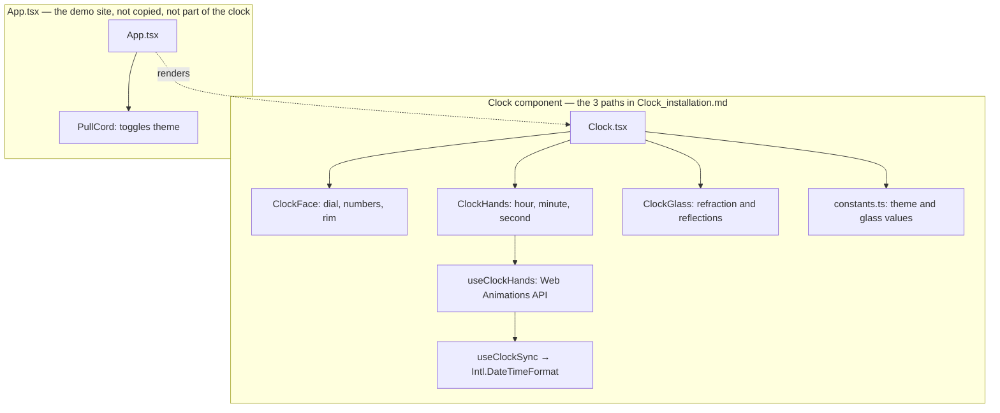

# Timelapse Clock: architecture

This document covers the clock component. The clock has no dependency on the website that demos it — the diagram below draws that as two separate boxes on purpose.

The only line crossing the boundary is the dotted one: the website renders `<Clock />` the same way any consumer would. Nothing flows the other direction — the clock has no reference to the website, the pull cord, or anything in `App.tsx`.

## The clock component

`components/Clock.tsx` reads the current time, calculates the hand angles, and assembles the dial, hands, rim, and glass layers. It accepts `theme="light" | "dark"`, an optional `timeZone`, `maxSize`, and `ariaLabel`. It imports its own `components/Clock/clock.css` and has no outer or background shadow — that shadow belongs to whatever page places the clock.

- `ClockFace.tsx` — static dial details and the rim image.
- `ClockHands.tsx` — the moving hands. The yellow tail and centre cap are intentionally layered as one mechanism.
- `ClockGlass.tsx` — sits last, creating the convex lens effect above all clock parts.
- `constants.ts` — both palettes and the `CLOCK_GLASS` tuning values, so visual changes stay centralized.

See [Clock_installation.md](./Clock_installation.md) for the exact copy list and [README.md](./README.md) for props and usage.

## Time flow

A clock is a linear function of time, so the component does no per-frame work at all. `useClockHands` gives each hand one infinite rotation (60s, 60min, 12h) through the Web Animations API and seeks its playhead to the current wall-clock position. The browser's animation engine owns the sweep from there: no React renders, no allocations, and no main-thread JavaScript per frame, so the hands stay smooth even while the main thread is busy.

`useClockSync` re-seeks every hand on a shared checkpoint that lands on :00 and :30 of each minute, and whenever the tab is restored. An animation timeline is monotonic while wall-clock time is not, so this is what absorbs daylight-saving jumps, NTP corrections, and sleep/resume. All clocks on a page share one timer.

`readClockTime` reads the requested zone through `Intl.DateTimeFormat`, so daylight-saving rules are handled by the browser. `Clock` defaults to the `Asia/Chennai` alias, normalized to the official `Asia/Kolkata` zone (IST, UTC+05:30). An unrecognized zone falls back to the device's own zone with one warning rather than throwing through render.

## The demo site (not part of the clock)

`App.tsx` is a separate consumer of the clock, kept in this same repository for convenience. It renders a plaster wall, a physical pull cord, and an installation-code monitor around one `<Clock />`. None of it ships with the component: copying only the three paths in [Clock_installation.md](./Clock_installation.md) leaves all of this behind.
